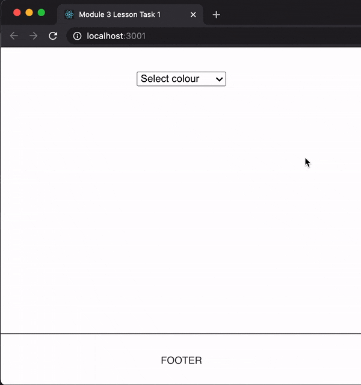

# JS Frameworks Module 3 Lesson Task 1

Create a sticky footer (a footer that is always at the bottom of the page regardless of content height) and a component with a select box that changes the background colour of the footer.

The colour should be maintained between page reloads.

Use Context and local storage.

